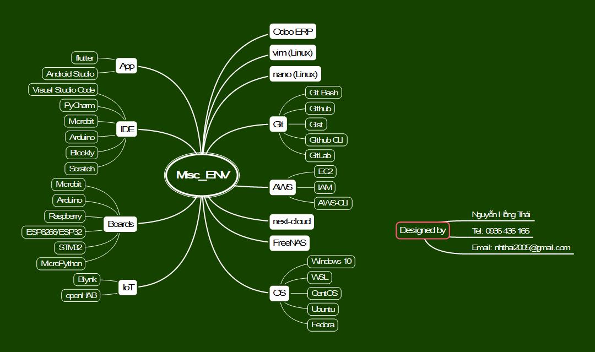

# HOME LAB
> First, I built **basic ENV** for self-study and shared my friends and colleagues

> Then, I continue upgrade **advance ENV** towards learning, in-depth research

> Besides, I also do step by step for **Dev ENV** as the schedule of learning:

> And I add the things I care about IoT, mobile-Apps

>	I like some Labs on internet. I don’t who they are but I got knowledge through their labs, as following belows:

*	### Tin học thật là đơn giản
    *	**Youtube:** <https://www.youtube.com/c/Tinhọcthậtlàđơngiản/>
*	### XuanThuLab
    *	**Youtube:** <https://www.youtube.com/c/XuanThuLab/>
    *	**Web:** <https://xuanthulab.net/>
*	### Trung Tâm Java Master
    *	**Youtube:** <https://www.youtube.com/c/TrungTamJava>
    *	**Web:** <http://learn.trungtamjava.com/>
*	### TechMaster Vietnam:
    *	**Youtube:** <https://www.youtube.com/user/TechMasterVN>
    *	**Web:** <https://techmaster.vn/>
*	### Code4Func - Kỹ thuật lập trình:
    *	**Youtube:** <https://www.youtube.com/channel/UC9iHsS3YvJw-oJMshLD69Hg/featured>
    *	**Web:** <https://www.code4func.com/> 
*	### Kodekloud:
    *	**Web:** <https://kodekloud.com/courses>
*	### Play with Docker classroom
    *	**Web:** <https://training.play-with-docker.com/>
    *	**Lab:** <https://labs.play-with-docker.com/>