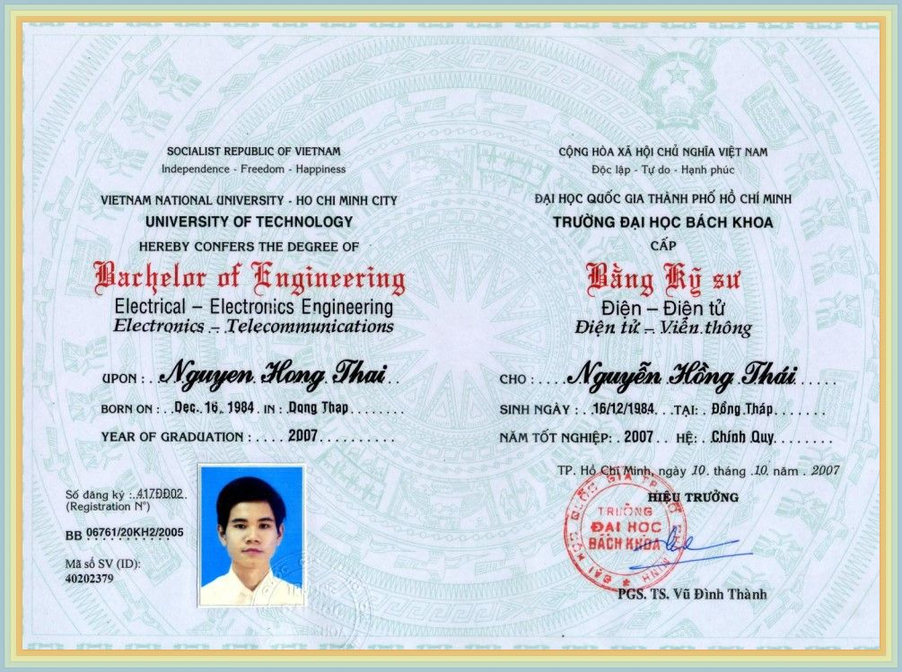
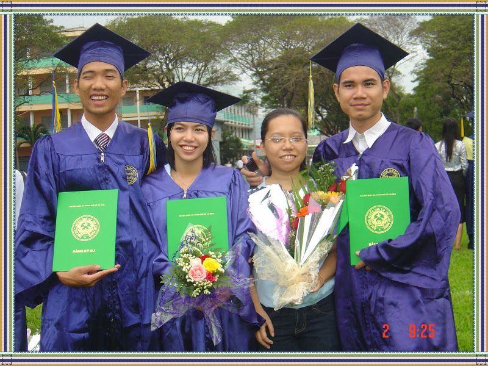
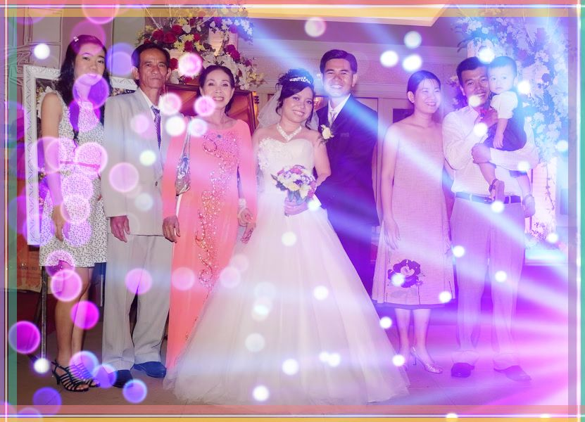
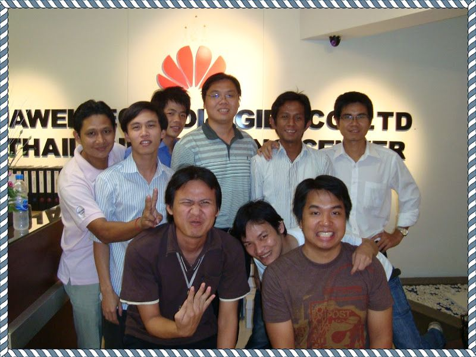
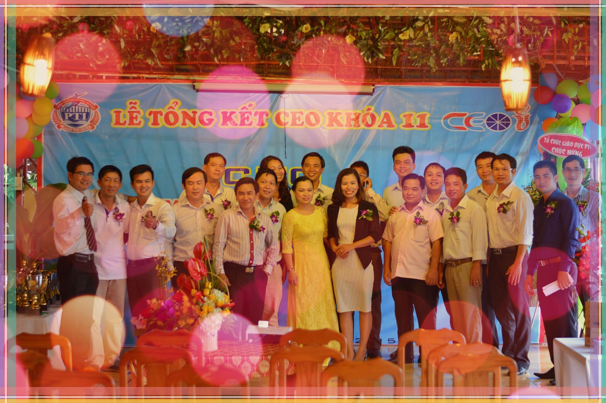
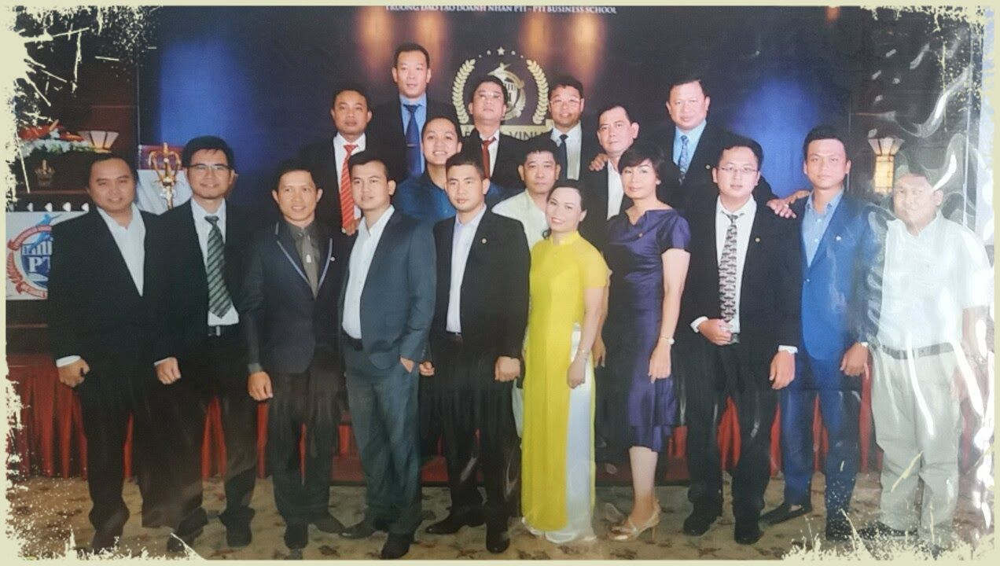
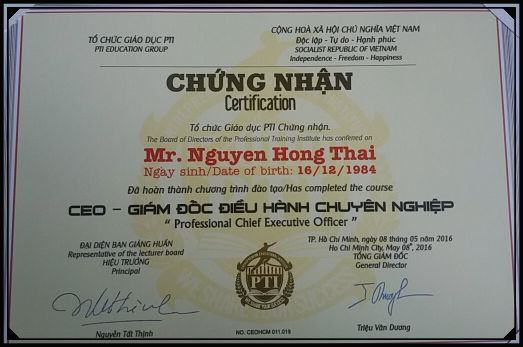

> Hello everybody:
> 
> I have spent my life with many memorable wishes. I graduated from Ho Chi Minh City University of Technology with a prestigious degree.

> I have great school friends!

> Then, I got married. And I love my family very much!

> Next, I went to work at Huawei company. There, I had wonderful colleagues. They come from Southeast Asian countries.

> Outside of society, I also have very close friends. They are successful people in companies. I got to know them when I took the CEO course.

> We went through the course with a lot of useful knowledge. At the end of the course, we participated in the honor ceremony ...

> ... along with a certificate of achievement.

> And those are the most memorable memories in my life. I love my life.
